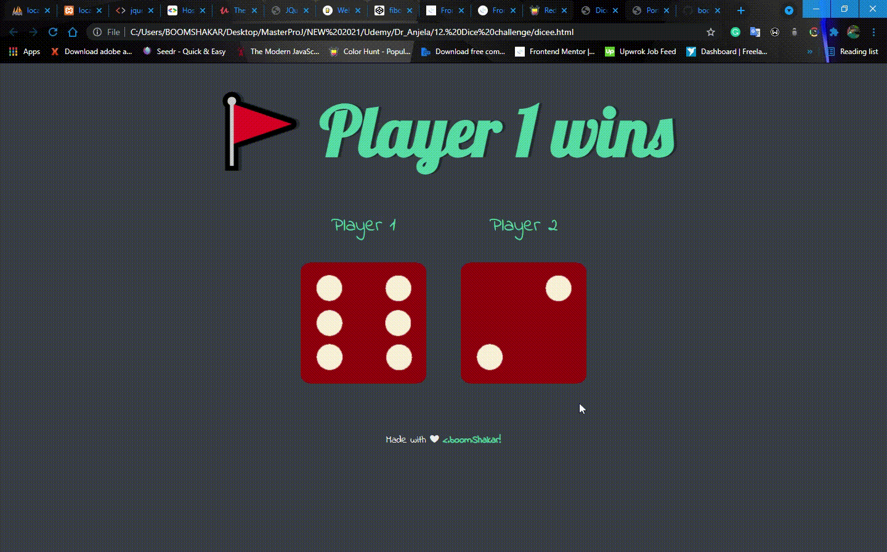

## Table of contents

- [Overview](#overview)
  - [The challenge](#the-challenge)
  - [Screenshot](#screenshot)
  - [Links](#links)
- [Built with](#built-with)
- [Author](#author)

## Overview

This is a simple dice game for everyone. Just refresh the page to generate a new random number.

### The challenge

Users should be able to:

- View the optimal layout depending on their device's screen size
- Get random numbers everytime the page is refreshed

### Screenshot

### Links

- Solution URL: [Solution URL here](https://github.com/boomshakar/roll-your-dice)
- Live Site URL: [Live site URL here](https://rollyourdice.netlify.app/)

### Built with

- Semantic HTML5 markup
- JavaScript
- CSS

## Author

- Website - [Oluwafemi Sosanya](https://boomshakar.netlify.app/contact.html)
- Twitter - [@_boomshakar_](https://www.twitter.com/_boomshakar)
